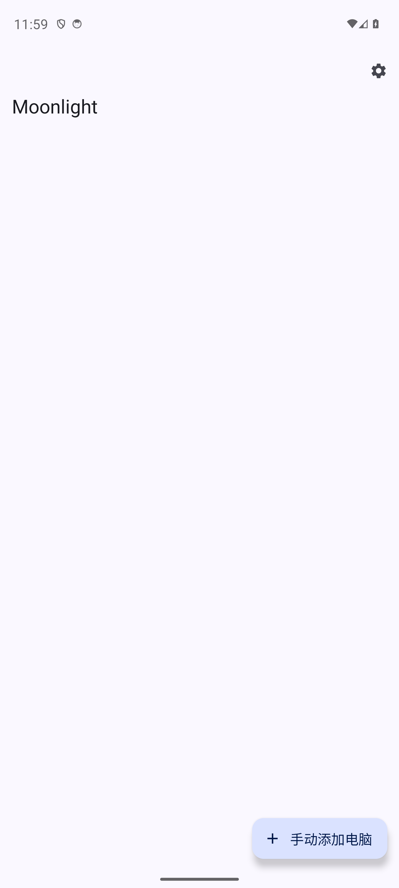
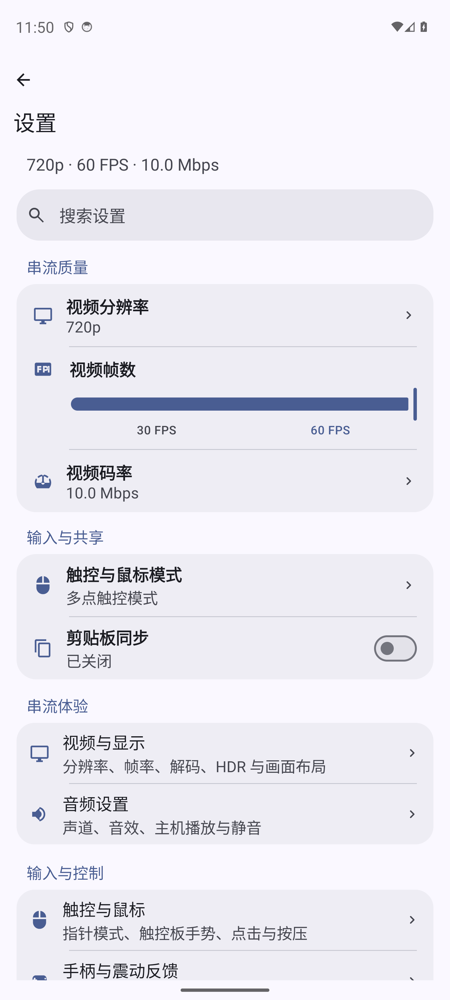
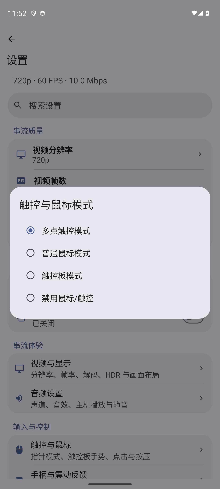
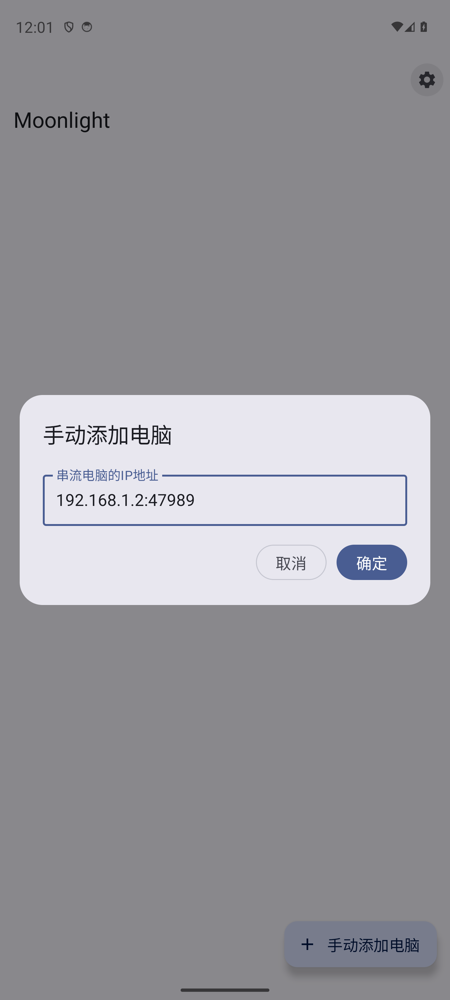

<div align="center">
  
  <h1>Moonlight for Android</h1>
  <p>面向远程桌面、原生触控板输入和跨设备协作的 Moonlight 独立分支</p>

  [](https://github.com/silverpoetry/moonlight-android/releases)
  [](LICENSE.txt)
  [](https://developer.android.com/)
</div>

[特色功能](#特色功能) · [界面预览](#界面预览) · [安装与迁移](#安装与迁移) · [构建与质量门禁](#构建与质量门禁) · [架构文档](ARCHITECTURE.md) · [变更记录](CHANGELOG.md)

Moonlight for Android 是一个独立维护的 Moonlight Android 分支。项目保留
GameStream/Sunshine 串流链路，并围绕 Android 手机、平板和大屏设备重新整理界面、输入、
文件协作和运行时架构。当前产品名称为 **Moonlight**，普通 Release 包名为
`com.silverpoetry.moonlight`。

## 特色功能

- 基于 Jetpack Compose 和 Material 3 的现代界面，支持深浅色主题、动态取色，以及手机、
  平板和大屏设备的自适应布局。
- 现代设计的串流快捷菜单，支持快捷控制和即时设置。
- 原生触控板、多指手势、本地光标、气压计重按，以及可自定义的虚拟手柄和虚拟按键。
- 统一同步文字、图片、文件和文件夹，支持按需文件传输和向主机桌面分享文件。
- 支持串流麦克风、性能面板、画中画、自由窗口、横竖屏和 HDR。
- 支持配置 ZIP 导入导出，可选择迁移应用设置、主机连接信息和客户端身份。

## 界面预览

<table>
  <tr>
    <td align="center"><strong>主界面</strong></td>
    <td align="center"><strong>设置</strong></td>
  </tr>
  <tr>
    <td></td>
    <td></td>
  </tr>
  <tr>
    <td align="center"><strong>触控与鼠标模式</strong></td>
    <td align="center"><strong>手动添加电脑</strong></td>
  </tr>
  <tr>
    <td></td>
    <td></td>
  </tr>
</table>

## 项目架构

项目采用“平台无关核心 + Android 适配层 + 原生协议层”的分层结构。Compose 只负责
非实时展示，输入、音频、视频和协议回调使用有界、可取消、可验证的实时路径。

```text
Android entry points and Compose UI
             │
             ▼
feature controllers and immutable UI state
             │
             ▼
core:hosts   core:settings   core:transfer   core:virtual-controls
             │
             ▼
Android/protocol adapters and native stream pipeline
             │
             ▼
moonlight-common-c / JNI  <──>  Sunshine
```

| 模块 | 职责 |
| --- | --- |
| `app` | Android Activity、Compose UI、生命周期组合、SAF/URI、数据库、mDNS、NvHTTP、JNI、串流和发布打包 |
| `core:hosts` | 不可变主机模型、发现/配对/可达性契约、主机操作用例 |
| `core:settings` | 类型化设置键、默认值、校验、迁移、快照和运行态设置模型 |
| `core:transfer` | 文件清单协议、校验、编码和传输生命周期 |
| `core:virtual-controls` | 虚拟手柄/按键布局值对象、文档编码和仓库契约 |
| `core:shield-controller-extensions` | NVIDIA SHIELD 外设兼容库 |
| `build-logic` | 依赖边界、质量门禁、发布安全策略和 SBOM 任务 |

关键约束：每个可变状态只有一个所有者；UI 通过不可变状态和语义事件工作；实时路径
不访问磁盘、不等待远端、不创建无界队列；文件清单、能力协商和真正的数据读取分开；
销毁后的回调不能写入新的会话或页面。完整设计依据见 [ARCHITECTURE.md](ARCHITECTURE.md)。

## 兼容性

- 最低系统：Android 6.0（API 23）。
- 编译和目标 API：37。
- 推荐产品：`nonRootRelease`，包名 `com.silverpoetry.moonlight`。
- Root 产品：`rootRelease`，包名 `com.silverpoetry.moonlight.root`，面向确实需要
  root 变体能力的设备；该变体有单独的最高系统版本限制。
- Android 设备需要与兼容的 Sunshine/Moonlight 主机端配套，触控板、麦克风和新版文件
  传输能力以双方协商结果为准。

Android 客户端、Moonlight Qt、Sunshine 和共享 `moonlight-common-c` 应尽量使用同一
发布批次。当前仓库固定的 common-c 修订为
[`ac7f234`](app/src/main/jni/moonlight-core/moonlight-common-c)。配套项目如下：

| 项目 | 职责 | 仓库 |
| --- | --- | --- |
| Moonlight Android | Android 客户端、移动端输入、剪贴板、文件、麦克风和 UI | 当前仓库 |
| Sunshine | Windows 主机、原生触控板注入、剪贴板和麦克风接收 | [silverpoetry/Sunshine](https://github.com/silverpoetry/Sunshine) |
| Moonlight Qt | Windows 客户端、桌面输入和对称文件剪贴板 | [silverpoetry/moonlight-qt](https://github.com/silverpoetry/moonlight-qt) |

## 安装与迁移

从 [GitHub Releases](https://github.com/silverpoetry/moonlight-android/releases) 下载
对应设备的 APK 和校验文件。普通设备安装 `nonRootRelease`；诊断问题时使用带有
`.debug` 后缀的 Debug 包，不把诊断日志带入正式包。

Release 使用完整 R8 代码优化、混淆和资源收缩。发布时应同时归档 APK、R8 mapping、
SHA-256、版本信息和签名证书摘要。普通 Release 可以覆盖安装同包名的旧版本并保留
设置、主机和客户端身份；包名不同的历史测试包需要先按迁移说明导出或迁移数据，再安装
正式包。

## 构建与质量门禁

需要 JDK 21、Android SDK、Android NDK `27.0.12077973` 和 Git 子模块：

```powershell
git submodule update --init --recursive
.\gradlew.bat nonRootRelease
```

日常开发只构建普通 non-root Release。提交前运行单变体门禁：

```powershell
.\gradlew.bat verifyNonRootRelease --no-daemon
```

该门禁包含核心模块测试、应用 Release 单元测试、Release Lint、架构与安全检查、依赖
和原生依赖校验以及 APK 构建。完整本地门禁为：

```powershell
.\gradlew.bat verifyLocal --no-daemon
```

设备验证、升级覆盖安装、回滚演练、跨客户端剪贴板/麦克风矩阵和发布证据要求见
[TESTING.md](TESTING.md) 与 [Release Runbook](docs/architecture/RELEASE_RUNBOOK.md)。

## 隐私与安全

- 剪贴板、文件和麦克风能力只在串流会话中、双方协商后启用。
- 文件复制不会在用户按下复制键时读取或上传整个目录；真实内容只在远端明确请求后
  进入传输队列。
- 主机数据库、固定主机证书、客户端证书和私钥保存在应用私有目录，并排除 Android
  自动备份。显式配置导出由用户主动发起，ZIP 内含私钥时应妥善保存。
- Release 日志不记录剪贴板正文、文件路径、证书、私钥、麦克风采样或逐事件实时轨迹。
- 依赖来源、许可证文本和 SBOM 规则见 [DEPENDENCIES.md](DEPENDENCIES.md) 和
  `app/src/main/assets/third_party_licenses`。

## 文档索引

- [架构总则](ARCHITECTURE.md)
- [变更记录](CHANGELOG.md)
- [参与贡献](CONTRIBUTING.md)
- [贡献者、代码来源与许可证边界](CONTRIBUTORS.md)
- [第三方声明](THIRD_PARTY_NOTICES.md)
- [测试与发布前验证](TESTING.md)
- [依赖和 SBOM 策略](DEPENDENCIES.md)
- [隐私说明](PRIVACY.md)
- [安全策略](SECURITY.md)
- [设置架构与配置迁移](docs/architecture/SETTINGS_ARCHITECTURE.md)
- [模块边界](docs/architecture/GRADLE_MODULE_BOUNDARIES.md)
- [实时线程约束](docs/architecture/REALTIME_THREADING.md)
- [串流会话生命周期](docs/architecture/STREAM_SESSION_LIFECYCLE.md)
- [输入行为基线](docs/architecture/INPUT_BEHAVIOR_BASELINE.md)
- [窗口、视口和坐标系统](docs/architecture/STREAM_VIEWPORT_GEOMETRY.md)
- [Android 安全边界](docs/architecture/ANDROID_SECURITY_BOUNDARIES.md)
- [重构路线图与完成记录](docs/architecture/REFACTORING_ROADMAP.md)
- [发布 Runbook](docs/architecture/RELEASE_RUNBOOK.md)
- [架构决策记录](docs/adr)
- [质量基线](QUALITY_BASELINE.md) · [质量改进计划](QUALITY_IMPROVEMENT_PLAN.md) · [迁移日志](QUALITY_MIGRATION_LOG.md)

## 贡献与许可

提交问题或补丁时，请说明设备、Android 版本、产品变体、主机端版本和可复现步骤；涉及
输入、传输、协议、权限或串流生命周期的变更应同时提供对应的契约测试或验证记录。
开发规则见 [CONTRIBUTING.md](CONTRIBUTING.md)。请勿上传个人设备地址、证书、私钥、
剪贴板内容、文件路径或麦克风录音。

本项目是 Moonlight Android 的独立分支，相关上游作者、历史来源、外部移植和许可证
记录见 [CONTRIBUTORS.md](CONTRIBUTORS.md) 和
[THIRD_PARTY_NOTICES.md](THIRD_PARTY_NOTICES.md)。项目整体许可为
[GPL-3.0](LICENSE.txt)，第三方依赖的许可证随源码和安装包提供。Moonlight、Sunshine
以及设备和厂商名称归各自权利人所有；项目与相关品牌不存在官方隶属或背书关系。
